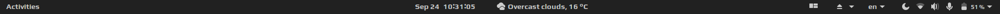

# Bash scripts for modifying official Pop!\_OS GTK/GNOME Shell theme

## Author:
* Aleksandar Anžel

### About:
* These scripts were recently modified to support Pop!\_OS 20.04 (GNOME 3.36)
* The script [pop-color-change.sh](pop-color-change.sh) changes orange and blue/teal accent colors with red accent color. This is done both for GTK and SHELL Pop!\_OS theme (light and dark variant).
* The script [pop-shell-ext-change.sh](pop-shell-ext-change.sh) changes orange active hint color of the Pop Shell extension with red color. This is done both for the light and dark variant.


### Running:
```shell
sudo sh pop-color-change.sh
```
* Wait for script to finish executing (~1.5 min)

```shell
sudo sh pop-shell-ext-change.sh
```

### Dependencies (apt package manager):
```shell
sudo apt install sassc meson libglib2.0-dev inkscape optipng
```
* The additional dependencies are needed because the official Pop!\_OS theme is compiled *in situ* with changed colors. This means that new icons with changed colors are rendered with [pop-color-change.sh](pop-color-change.sh) script.

### Additional info:
* Color changes are all documented in [Dark_red_shell.sed](Dark_red_shell.sed) and [Dark_grey_shell.sed](Dark_grey_shell.sed). First document changes the native dark orange color with dark red color. Second document changes the native dark orange color with neutral grey color.

If you wish to modify the original Pop!\_OS theme with this script but with other accent color, you should change only [Dark_grey_shell.sed](Dark_grey_shell.sed) file.

### Screenshots
## Dark variant, dark red color scheme:


## Dark variant, dark grey color scheme with Pop Shell extension activated:




